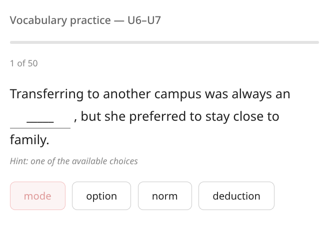
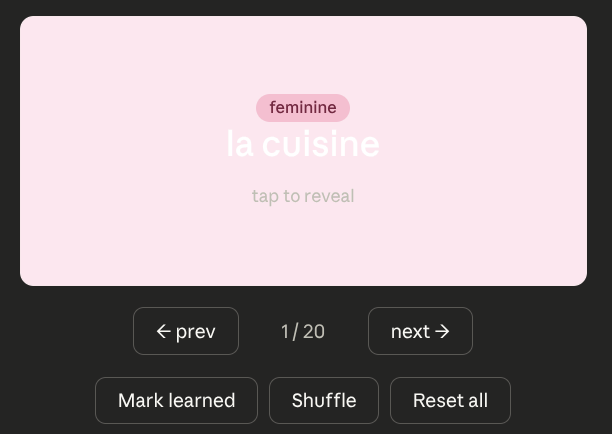
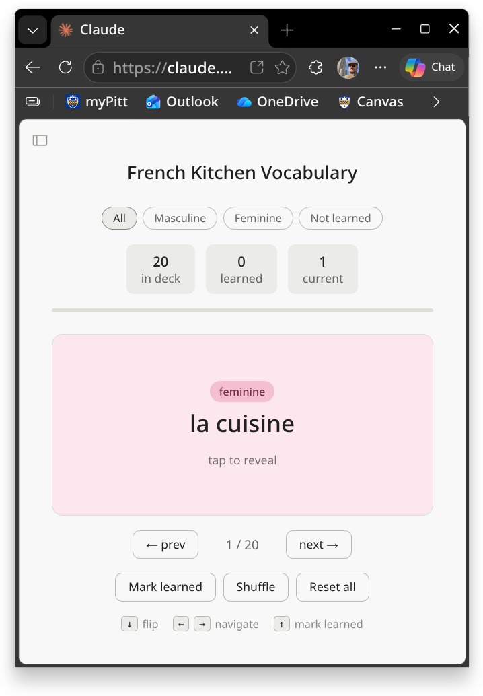

# Rapid Interactive Materials Creation with Claude Artifacts

Bill Price, 17 April 2026

Presented as part of _[Language Instruction and Generative AI at Pitt: a Working Group's Report](https://www.polyglot.pitt.edu/events/language-instruction-and-generative-ai-pitt-working-groups-report)_

## What Is Claude, and What Are Artifacts?

Claude is an AI assistant developed by Anthropic, available to University of Pittsburgh faculty and students through Pitt's institutional subscription at [claude.ai](https://claude.ai/). Beyond generating text, Claude can produce self-contained, interactive web applications called "Artifacts" which are fully functional HTML/JavaScript tools that run directly in the browser, require no installation, and can be shared via link with anyone who has a Pitt account.

For language instructors, this means that a vocabulary quiz, a flashcard deck, a listening activity, or a reading exercise with interactive components can go from an idea to a published, shareable activity in a single conversation, without writing any code yourself.

***

## A Real Example: Vocabulary Practice for Linguistics 0010

I was recently preparing students in my Ling 0010 - ESL Reading and Vocabulary course for an upcoming assessment covering 30 target words. I needed something students could use to practice independently, but I wanted to avoid the "freemium" commercial tools like Quizlet. (I've learned the hard way to avoid lock-in on platforms that might unpredictably yank features or degrade the user experience; and at least with Claude, you can download the programmed activities you create and host them on your own web server if you ever need or prefer to do so. That portability matters to me.)

I opened Claude, gave it the list of target words and some context about the course and assessment format, and asked for a list of possible interactive activity ideas. 

After a brief back-and-forth, Claude produced a cloze (fill-in-the-blank) exercise activity. Each item presents a sentence with a gap and four multiple-choice options. Selecting the correct answer lights it up green and advances to the next item; selecting an incorrect answer marks it red and allows the student to keep trying. I requested a few tweaks and revisions, but I was soon happy with what I was seeing.

The format of this activity is simple enough, but as any instructor knows, drafting good items and distractors is usually 80% of the battle. Even there, though, Claude greatly accelerated development; it not only programmed the interface, but also drafted all the sentences and content based on the 30 target words I had provided it. This could have taken multiple hours to do by hand, but Claude drafted a usable bank of materials in about one minute.

Once the cloze exercize Artifact was built, I published it with a shareable link set to "Anyone in your organization," then posted that link on Canvas as an external resource. 

In class, I explained that the resource was a study activity for next class’s vocabulary quiz, and that I had created it through Claude using our vocabulary list. Students clicked through, log in with their Pitt credentials (a bit clunky: the login workflow takes them from Claude to Microsoft to Pitt and then back to Claude), and the activity then opened in their browser. Since some students were using phones and others were using laptops, we were able to confirm naturally that the activity loaded correctly and operated correctly on both types of device.

You can try the activity yourself here (log in with your Pitt email address): [https://claude.ai/artifacts/latest/e615d8a7-6537-4d6b-9a85-44aae595e1af](https://claude.ai/artifacts/latest/e615d8a7-6537-4d6b-9a85-44aae595e1af).

The whole process, from my first exploratory brainstorming prompt to posting the working link on Canvas link, took under an hour.

**Limitation worth keeping in mind:** Claude-hosted Artifacts don't report scores back to Canvas or any LMS. They're appropriate for low-stakes practice and self-study, not for graded assessments that require score recording or academic integrity controls. My only goal was to provide students with a studying tool, though, so that issue did not interfere with my purposes.

***

## A Walkthrough: Building a French Flashcard Tool

To illustrate the workflow more explicitly, here's a step-by-step account of building a simple French kitchen vocabulary flashcard tool; the kind of thing any language instructor could replicate in about 15 minutes.

**Step 1: Provide the vocabulary and a clear task.**  
I gave Claude a list of 20 French kitchen vocabulary words with English translations and grammatical gender, then asked for a flashcard studying Artifact, with the cards color-coded by gender, with features like shuffle and "mark as learned."

Here is the exact message I sent:

> Here are 20 French vocabulary words for a kitchen lesson:
>
> 1.  la cuisine — kitchen
> 2.  le four — oven
> 3.  le réfrigérateur — refrigerator
> 4.  le congélateur — freezer
> 5.  la cuisinière — stove/range
> 6.  le micro-ondes — microwave
> 7.  l'évier (m.) — sink
> 8.  le lave-vaisselle — dishwasher
> 9.  le robinet — faucet
> 10.  la casserole — saucepan
> 11.  la poêle — frying pan
> 12.  la marmite — stockpot
> 13.  le couteau — knife
> 14.  la cuillère — spoon
> 15.  la fourchette — fork
> 16.  le bol — bowl
> 17.  l'assiette (f.) — plate
> 18.  le verre — glass
> 19.  la planche à découper — cutting board
> 20.  le torchon — dish towel
> 
> Your task is to create a flashcard studying artifact. Color code the cards by masculine and feminine gender. Include some appropriate extra features like shuffle, mark as learned, etc.

This is the first version Claude created:

**Step 2: Refine visually.**  
The first version used white card text on pastel backgrounds, which I found hard to read. I simply told Claude: _"Please make the card text black instead of white."_ It updated the Artifact immediately.

This is the second version Claude created:

**Step 3: Add functionality.**  
I asked Claude to add keyboard shortcuts: _"Add keyboard shortcuts if possible. down arrow to flip; left and right for previous and next; up arrow for mark learned."_ Claude implemented all of these in one step.

This is the third version Claude created:

**Step 4: Save and publish.**  
I used the "Save as Artifact" button to name and preserve the tool, then published it with organization-wide link sharing. The finished activity is available here (log in with your Pitt email address):  
[https://claude.ai/artifacts/latest/a0f8b6c4-ecc9-4988-b7df-f501ccfd6443](https://claude.ai/artifacts/latest/a0f8b6c4-ecc9-4988-b7df-f501ccfd6443)

The key point: no HTML was written, no JavaScript was debugged. The conversation _was_ the development process.

***

## The Bigger Picture

The cloze exercise and the flashcard tool are just examples of a much broader point. The actual takeaway is that Claude Artifacts give instructors a fast path to custom interactive materials that fit their exact pedagogical context, whatever that context happens to be. Just describe what you want, refine through conversation, publish, and share with students.

The trade-off is transparency: instructors should verify content accuracy before deployment, and students should ideally understand they're using practice materials whose creation was accelerated with AI assistance. 

But for low-stakes supplementary practice- filling in curricular gaps, providing extra ways to engage with materials, making studying more engaging- this workflow is fast, flexible, and genuinely useful.
