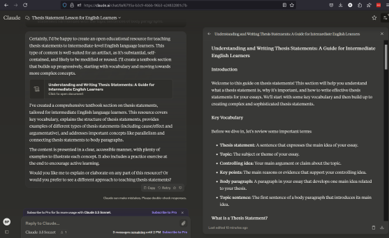

**User:**

I want to try to trigger the "Artifacts" feature of Claude 3.5 Sonnet: "Ask Claude to generate content like code snippets, text documents, or website designs, and Claude will create an Artifact that appears in a dedicated window alongside your conversation."

Let's attempt to generate an open educational resource that teaches the creation of thesis statements.

Thesis statements are taught in many ways, but my own preference is to teach a three-part structure:

Topic: the "thing" the essay is about

Controlling idea: your "claim" about the topic

Key points: A preview of your main sources of evidence to support your claim; usually there are three key points in a five-paragraph essay, one for each body paragraph. There should be a clear correspondence between the key points in the thesis statement and the topic sentences of the body paragraphs.

There is an optional fourth part to the thesis statement: A concession or acknowledgement. "Although it is true that ...," "While some believe that ...,"

I'm attaching some slides I've used in teaching essay and thesis statement structure.

For clarity, I teach English to speakers of other languages at a university. My students are generally aged 20-30 and use English as an additional language. Their proficiencies range from low-intermediate to low-advanced depending on the course. Most have academic or professional goals.

Your task is to imagine you are writing an approachable, accessible, engaging textbook for this student population that is useful and comprehensible for people of intermediate-level English proficiency. In this section of the textbook, you will teach thesis statements following the general parameters provided above and in the attached document. Use clear, direct prose in your explanations and provide excellent, illuminating examples. Try to incorporate both cause/effect rhetorical patterns (for example: ...due to X, Y, and Z; ... will lead to X, Y, and Z;... etc) and argumentative patterns.

I'm picturing a textbook section that sort of build on itself iteratively, starting perhaps with a review of necessary vocabulary, then building up progressively more complex and sophisticated thesis statements with explanations. Salient grammar points such as parallelism should be taught at least briefly. Some attention should also be paid to showing how the thesis statement harmonizes with the topic sentences of body paragraphs.

**Claude 3.5 Sonnet:**

Certainly, I'd be happy to create an open educational resource for teaching thesis statements to intermediate-level English language learners. This type of content is well-suited for an artifact, as it's substantial, self-contained, and likely to be modified or reused. I'll create a textbook section that builds up progressively, starting with vocabulary and moving towards more complex concepts.

I've created a comprehensive textbook section on thesis statements, tailored for intermediate English language learners. This resource covers key vocabulary, explains the structure of thesis statements, provides examples of different types of thesis statements (including cause/effect and argumentative), and addresses important concepts like parallelism and connecting thesis statements to body paragraphs.

The content is presented in a clear, accessible manner, with plenty of examples to illustrate each concept. It also includes a practice exercise at the end to encourage active learning.

Would you like me to explain or elaborate on any part of this resource? Or would you prefer to see a different approach to teaching thesis statements?

---

*Note: the material below appeared in a separate frame of the window to the right of the chat, as in the screenshot below*

---

# Understanding and Writing Thesis Statements: A Guide for Intermediate English Learners

## Introduction

Welcome to this guide on thesis statements! This section will help you understand what a thesis statement is, why it's important, and how to write effective thesis statements for your essays. We'll start with some key vocabulary and then build up to creating complex and sophisticated thesis statements.

## Key Vocabulary

Before we dive in, let's review some important terms:

- **Thesis statement**: A sentence that expresses the main idea of your essay.
- **Topic**: The subject or theme of your essay.
- **Controlling idea**: Your main argument or claim about the topic.
- **Key points**: The main reasons or evidence that support your controlling idea.
- **Body paragraph**: A paragraph in your essay that develops one main idea related to your thesis.
- **Topic sentence**: The first sentence of a body paragraph that introduces its main idea.

## What is a Thesis Statement?

A thesis statement is like a roadmap for your essay. It tells your reader what your essay is about and what you're going to say about it. A good thesis statement usually appears at the end of your introduction paragraph.

## The Three-Part Structure of a Thesis Statement

A strong thesis statement typically has three main parts:

1. **Topic**: What your essay is about
2. **Controlling idea**: Your main argument or claim about the topic
3. **Key points**: Usually three main reasons or pieces of evidence that support your claim

Let's look at some examples:

### Simple Thesis Statement

"Social media has changed the way we communicate."

- Topic: Social media
- Controlling idea: has changed the way we communicate

This is a basic thesis statement. It tells us what the essay is about (social media) and makes a claim about it (it has changed communication). However, it doesn't give us much detail about how or why.

### Improved Thesis Statement

"Social media has revolutionized communication by enabling instant global connections, fostering new forms of self-expression, and reshaping how we share information."

- Topic: Social media
- Controlling idea: has revolutionized communication
- Key points: 
  1. enabling instant global connections
  2. fostering new forms of self-expression
  3. reshaping how we share information

This improved thesis statement not only tells us what the essay is about and makes a claim, but it also previews the main points that will be discussed in the body paragraphs.

## Cause and Effect Thesis Statements

Cause and effect essays explore why something happens (causes) or what happens as a result (effects). Here's an example of a cause and effect thesis statement:

"Climate change is causing significant environmental problems due to rising sea levels, increasing global temperatures, and more frequent extreme weather events."

- Topic: Climate change
- Controlling idea: is causing significant environmental problems
- Key points (causes): 
  1. rising sea levels
  2. increasing global temperatures
  3. more frequent extreme weather events

Notice how this thesis statement uses the phrase "due to" to introduce the causes.

## Argumentative Thesis Statements

Argumentative essays present a claim and support it with evidence. Here's an example of an argumentative thesis statement:

"Despite concerns about privacy, social media platforms provide more benefits than drawbacks because they facilitate global communication, offer opportunities for business growth, and enable rapid information sharing during crises."

- Topic: Social media platforms
- Controlling idea: provide more benefits than drawbacks
- Key points: 
  1. facilitate global communication
  2. offer opportunities for business growth
  3. enable rapid information sharing during crises

This thesis statement acknowledges a counterargument ("Despite concerns about privacy") before presenting its main claim.

## Adding a Concession

Sometimes, it's effective to acknowledge an opposing viewpoint in your thesis statement. This is called a concession. Here's an example:

"While some argue that social media is harmful to mental health, its benefits in connecting people, providing support networks, and offering educational resources outweigh these concerns."

The phrase "While some argue that..." introduces the concession.

## Parallelism in Thesis Statements

When listing your key points, it's important to use parallel structure. This means using the same grammatical form for each item in the list. For example:

"Learning a new language improves cognitive function by enhancing memory, boosting problem-solving skills, and increasing attention span."

Notice how each key point starts with an -ing verb (enhancing, boosting, increasing).

## Connecting Thesis Statements to Body Paragraphs

Your thesis statement should provide a preview of your body paragraphs. Each key point in your thesis typically corresponds to a topic sentence in a body paragraph. For example:

Thesis statement: "Social media has revolutionized communication by enabling instant global connections, fostering new forms of self-expression, and reshaping how we share information."

Body paragraph 1 topic sentence: "One of the most significant ways social media has changed communication is by enabling instant global connections."

Body paragraph 2 topic sentence: "Social media platforms have also fostered new forms of self-expression, allowing users to share their thoughts and experiences in innovative ways."

Body paragraph 3 topic sentence: "Finally, social media has fundamentally reshaped how we share and consume information in our daily lives."

## Practice Exercise

Now it's your turn! Try writing thesis statements for the following topics:

1. The impact of technology on education
2. The benefits of regular exercise
3. The effects of plastic pollution on marine life

Remember to include a topic, controlling idea, and three key points in each thesis statement.

## Conclusion

Writing effective thesis statements is a crucial skill for academic writing. By including a clear topic, a strong controlling idea, and specific key points, you can create thesis statements that guide your reader and provide a roadmap for your essay. Keep practicing, and soon you'll be crafting strong thesis statements with ease!
