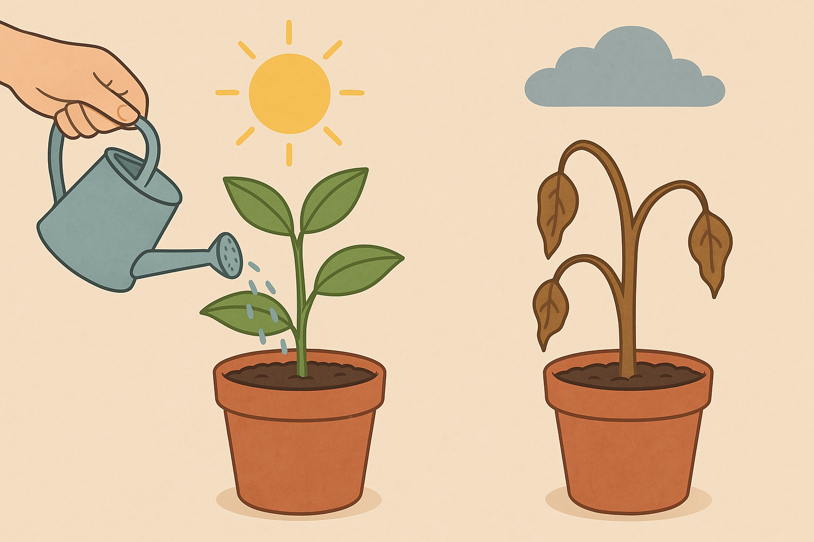
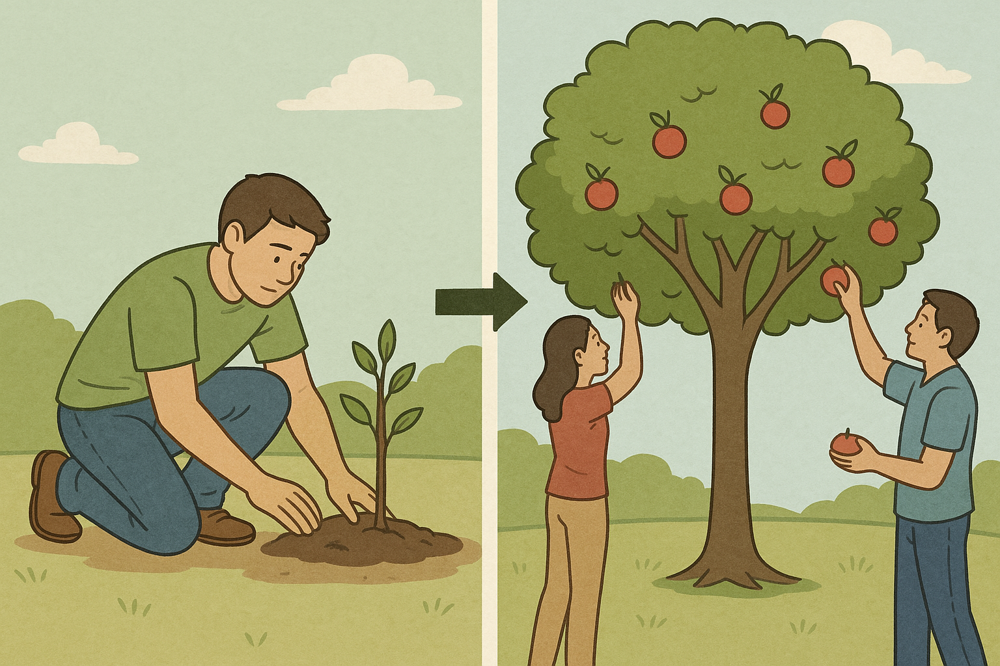

## Prompt:
I'm an educator. I'm currently in the process of creating study materials for my students. As part of this effort, I'm looking to generate some illustrations that can visually explain various concepts or vocabulary words we're covering. I've found that images, especially those that are simple, clear, and consistent, can be incredibly helpful for learning.

Could you help me create illustrations that represent specific ideas or words without directly using the vocabulary terms in the image? I'm aiming for a style similar to wikiHow illustrations—straightforward and universally understandable. It's also important that these images don't contain any text, as I want the visuals to be as accessible as possible, regardless of the viewer's language skills.

For example, instead of directly illustrating the word 'conserve' with a label, I would want an image that shows the action of conserving, such as turning off a dripping tap. This approach helps in avoiding text in the visuals and focuses on the essence of the concept.

Let's try to make sure these images are suitable for educational use, capturing the essence of each concept clearly and effectively.

In the following messages, I will prompt you with words or concepts one at a time. For each item, I may or may not include a definition or suggestions for what the illustration could contain. Then, you will analyze my prompt and imagine three different ways to illustrate it. Then, you will present me with your three concepts in a numbered list. I will select one of your interpretations, and you will use that interpretation to generate the image.

Are you ready to begin?

## NEW: Example output (GPT-4o with March 2025 image generation update):

**ChatGPT:** 

Yes, I'm ready! Send me your first word or concept, and I'll provide three different ways to illustrate it.

**User:** 

outcome

**ChatGPT:** 

Here are three different ways to illustrate the concept of **"outcome"** without using text:

1.  **Path Divergence to Result** – A person stands at the start of two different paths. One path leads to a trophy (success), while the other leads to a broken sign (failure). This visually represents how different choices lead to different outcomes.
    
2.  **Plant Growth from Different Care** – Two identical plants in separate pots receive different treatment: one is watered and placed in sunlight, growing tall and healthy; the other is neglected, wilting and turning brown. This conveys how different actions lead to different results.
    
3.  **Student Exam Results** – Two students take an exam: one looks confident and prepared, while the other looks stressed and unprepared. Later, the confident student receives a high score, while the stressed student gets a low score. This shows how effort leads to different outcomes.
    

Let me know which concept you'd like me to illustrate!

**User:**

2

**ChatGPT:**

Let me know the next word or concept you'd like illustrated.

## OLD Example output (GPT-4):

**ChatGPT:** 

Yes, I'm ready to begin. Please provide me with the first word or concept, and if you have any specific ideas or definitions in mind, feel free to include them. I'll then offer three different ways to illustrate it for your consideration.

**User:** 

outcome

**ChatGPT:** 

Great, let's brainstorm some visual concepts for the word "outcome":

1. A person standing at a fork in the road, with one path leading to a sunny clearing and the other leading into a dark, overcast area. This represents the idea of decisions leading to different outcomes.
   
2. A sequence of dominoes falling over, with the last one about to hit a trophy, symbolizing the outcome of a series of actions leading to a successful result.

3. A person planting a tree, and next to it, the future outcome of their action: a full-grown tree with fruits being picked by people, showing the long-term outcome of a single action.

Please let me know which of these concepts you'd like me to use for the illustration, or if you have any other ideas or suggestions.

**User:** 

3

**ChatGPT:**

Here is the illustration representing the concept of "outcome" as you requested. On one side, you can see a person planting a small tree, and on the other side, the same tree is fully grown with people harvesting its fruits. This should visually convey the idea of the long-term positive outcome of an action without using any text.

## NEW Comparison image made by GPT-4o with the March 2024 image generation update

**ChatGPT:** 

Yes, I'm ready! Send me your first word or concept, and I'll provide three possible ways to illustrate it.

**User:**

Please create the following image for the word "outcome"; I don't need suggestions.

"A person planting a tree, and next to it, the future outcome of their action: a full-grown tree with fruits being picked by people, showing the long-term outcome of a single action."

**ChatGPT:**

Let me know if you need any modifications or another illustration.
